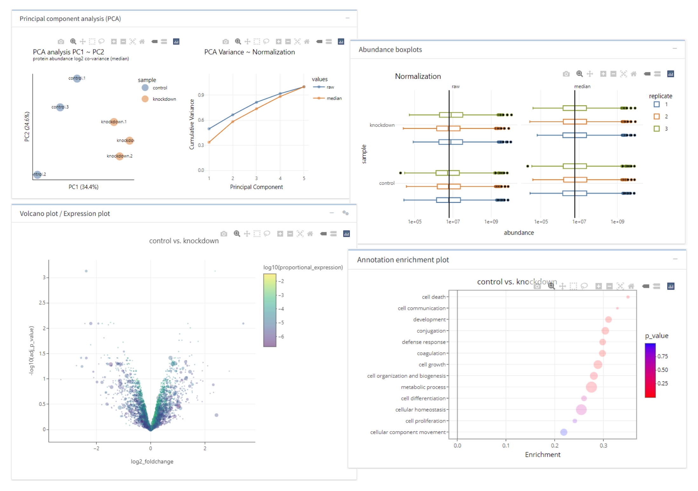

# tidyproteomics-interactive 

[](https://doi.org/10.1186/s12859-023-05360-7) [](https://hub.docker.com/r/ejmackrell/tidyproteomics-interactive)

This repository contains a Shiny application for interactively working with the R package [`{tidyproteomics}`](https://github.com/jeffsocal/tidyproteomics). Users may upload their protein- or peptide-level data for abundance subsetting, contaminant removal, abundance normalization, differential expression analysis, and ontology enrichment.



## Using the application

This application is hosted for public use by the Proteome Exploration Laboratory at the Beckman Institute at Caltech:

[bioinformatics.pel.caltech.edu/tidyproteomics/](http://bioinformatics.pel.caltech.edu/tidyproteomics/)

You may also run the application locally by following the instructions below.

------------------------------------------------------------------------

### Local installation with Docker

The application is available as a Docker image on [Docker Hub](https://hub.docker.com/r/ejmackrell/tidyproteomics-interactive). To use the application locally, follow these instructions:

1.  Clone this repository to a local directory using

    ``` bash
    $ git clone https://github.com/ejmackrell/tidyproteomics-interactive <dir>
    ```

2.  Download and install [Docker Desktop](https://www.docker.com/)

3.  Navigate to the directory and run the command

    ``` bash
    $ docker compose up
    ```

    to pull the Docker image, build a Docker container, and run the application.

You may access the running application at [`http://localhost:3838`](http://localhost:3838). To change the port from the default 3838, edit the specification for `ports` in `docker-compose.yml` (e.g., to `5000:3838` to access the application at port 5000).

------------------------------------------------------------------------

### Local installation with RStudio

You can also run the application locally in RStudio by following the instructions below.

#### Cloning the repository in RStudio

Install [`{renv}`](https://github.com/rstudio/renv) (if it is not installed already) by executing `install.packages("renv")`. Then, create a new version-controlled project in RStudio and provide the URL for this repository.

#### Restoring the project

Once the project is opened in your RStudio session, execute `renv::activate()` to load the project environment, which should download the appropriate version of [`{BiocManager}`](https://github.com/Bioconductor/BiocManager). Then, run `renv::restore()` to install all of the packages required for the project. If the repository for a Bioconductor package is not identified, you can manually install these packages individually by executing `renv::install("bioc::{package name}")`or instead as a group by specifying Bioconductor repositories with `renv::restore(repos = BiocManager::repositories())`.

------------------------------------------------------------------------

## Citation

If you use this application for your research, please cite our article. \> Jones, J., MacKrell, E.J., Wang, TY. *et al*. Tidyproteomics: an open-source R package and data object for quantitative proteomics post analysis and visualization. *BMC Bioinformatics* **24**, 239 (2023).
