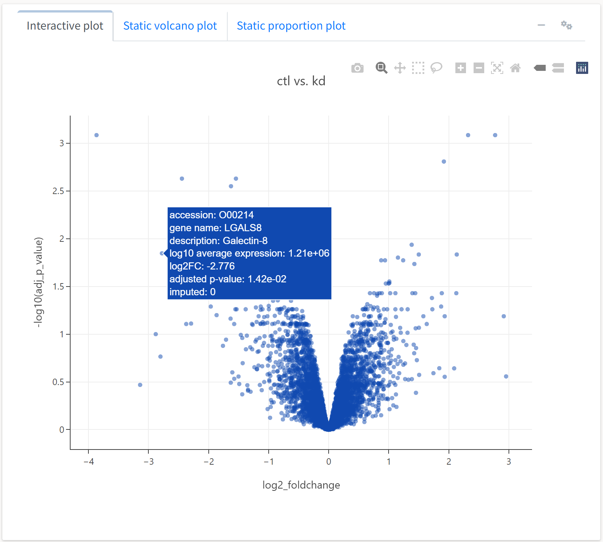
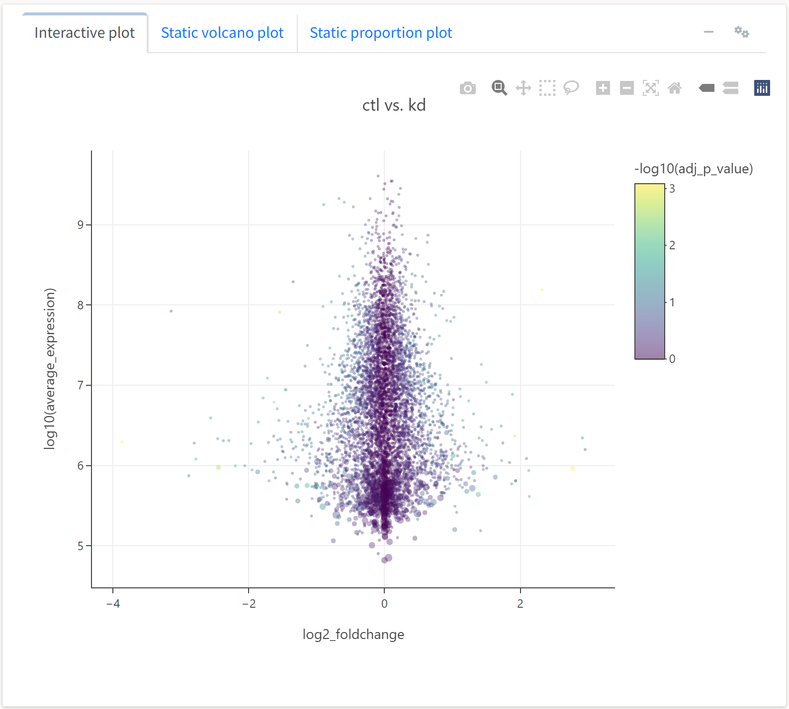

---
# Feel free to add content and custom Front Matter to this file.
# To modify the layout, see https://jekyllrb.com/docs/themes/#overriding-theme-defaults

layout: default
title: Expression analysis
nav_order: 1
parent: Data analysis
---
Having removed contaminant proteins, normalized our abundance values, and imputed missing abundance values, we are ready to conduct a differential expression analysis. The application allows the user to select the sample groups for the comparison and the statistical method for determining the expression differences. Here, we will use the `limma` method to leverage the emprical Bayes method for estimating sample variance.
  

  
The first output generated by the differential expression analysis is a volcano plot. By default, the x axis variable is the log fold change in base 2, and the y axis variable is the log FDR-adjusted p-value in base 10.
  

  
As this plot is interactive, we can perform all the operations afforded by the Plotly plotting package, including panning, zooming, and tooltips. Hovering over a protein will display much of its available metadata. We can also adjust several of the plotting parameters by clicking on the gears button at the top of the box. For example, we can set the color or size of the scatter points to be a function of several quantitative fields in the data object.
  

  
We'll set the color of the point to represent the proportion of replicates for which a protein's abundance was imputed, while the size will reflect the average abundance of the protein. 
  

  
Here, we see an expected trend: highly abundant proteins tend to not be as differentially expressed across treatments. We can also generate a different type a plot, an expression or M-A plot, to look at differential expression as a function of abundance.
  

  
We'll select the y axis variable to reflect the average expression of a protein, while the color and size will respect FDR-adjusted p-value and imputation frequency, respectively.
  

  
Here, we see the expression plot indicates much of the differential expression arises from low-abundance proteins, many of which tend to have missing values that required imputation. 

We may also be interested in rapidly identifying whether a protein of interest was differentially expressed in the experiment. To do so, we can use the interactive table displayed below the volcano plot. The table is searchable, filterable, sortable, and downloadable, and UniProtKB identifiers included in the data link to their UniProt summary page in the `protein` column. 
  

  
To filter fold change or p-value over a value range of interest, we can access additional options for the table by clicking on the gears icon. 
  

  
We will accept the default values, which filter the table for FDR-adjusted p-value less than 0.05 and absolute log2 fold change > 1. 
  

  
We see that 51 proteins meet these criteria.