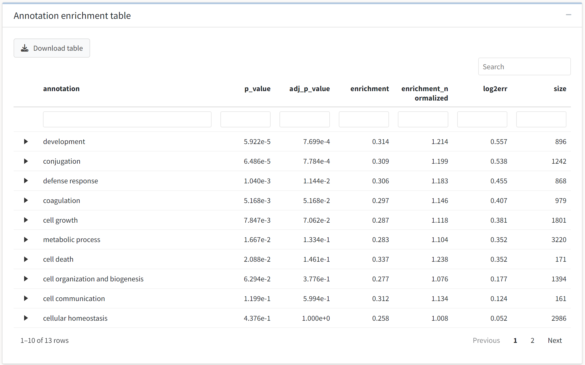

---
# Feel free to add content and custom Front Matter to this file.
# To modify the layout, see https://jekyllrb.com/docs/themes/#overriding-theme-defaults

layout: default
title: Enrichment analysis
nav_order: 2
parent: Data analysis
---
The last analysis option available in the application is ontology enrichment in the *Enrichment analysis* tab. If the user has conducted differential expression analysis, the dropdown menus for selecting the comparison of interest, annotation group of interest, and enrichment method should be enabled. You can select among two enrichment methods, GSEA or a Wilcoxon rank-sum test, to perform an enrichment analysis.  
Each comparison produced in the *Expression analysis* tab will populate the dropdown menu for the comparison selection. Here, we'll select the only comparison available from our analysis, `ctl/kd`, and we will examine enrichment of the Gene Ontology biological process annotations.
  

  

{: .note }
The application does not currently support the upload of a separate annotation table for conducting enrichment analysis or providing gene metadata in the table outputs. Users familiar with R can do so by working directly with the *tidyproteomics* package by following [this tutorial.](https://jeffsocal.github.io/tidyproteomics/articles/annotating.html)

Once the execution of the analysis has completed, we will be presented with a categorical scatter plot and an interactive table that details the annotated terms and their statistical enrichment.
  

  
Here, we see the GO:BP processes sorted on the y axis by their enrichment strength, while their color corresponds to the p-value of the enrichment. 
  

  
Next, we see an interactive data table output by the enrichment method. The table is again searchable, filterable, sortable, and downloadable. Further, the application will allow you to examine the expression analysis subset for proteins in each enriched term in a collapsible subtable. Click on a term of interest to see which proteins are contained in the enriched set. 
  

  

{: .note }
Tables with greater than 200 entries will not render the collapsible subtables to avoid performance issues.