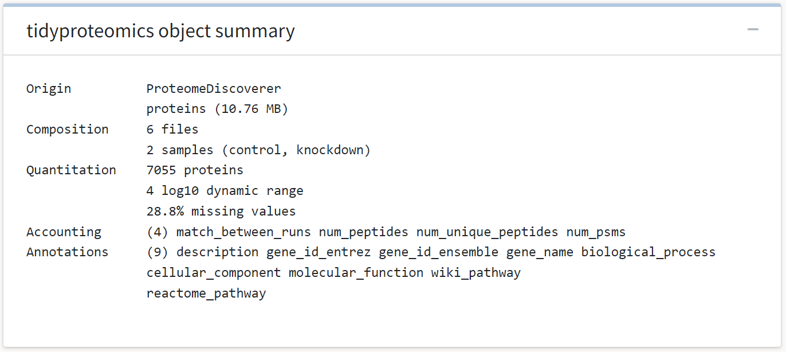
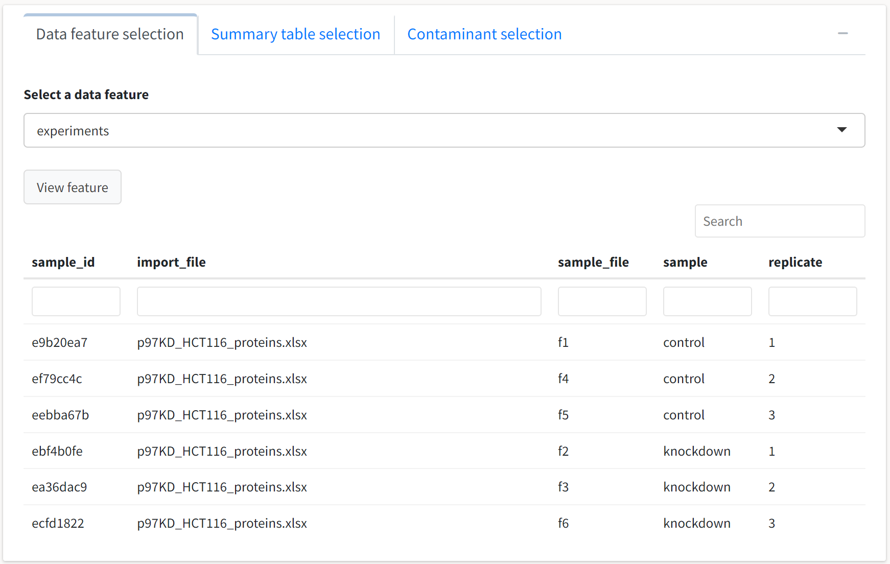
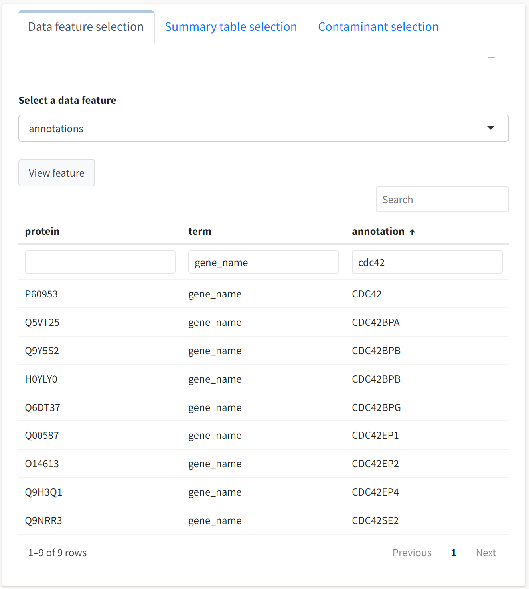
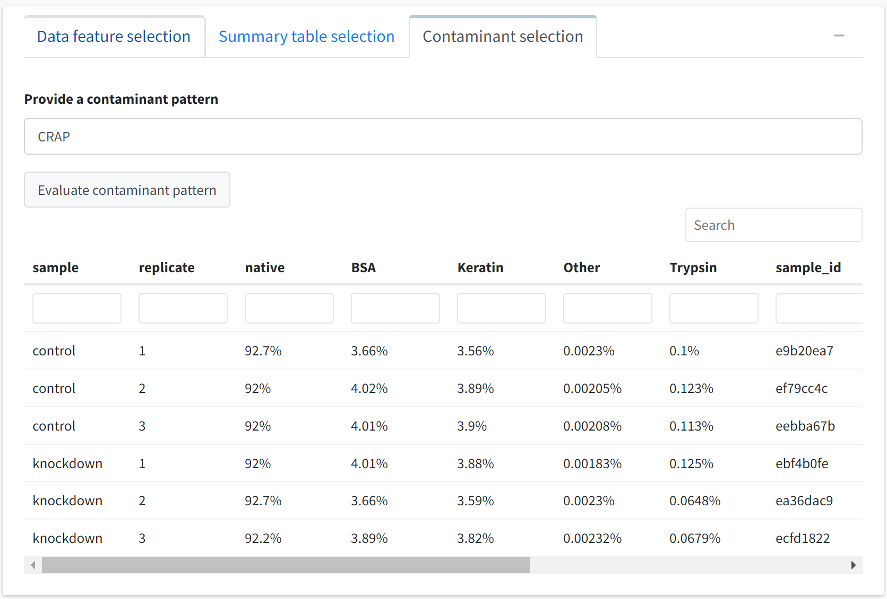

---
# Feel free to add content and custom Front Matter to this file.
# To modify the layout, see https://jekyllrb.com/docs/themes/#overriding-theme-defaults

layout: default
title: Data input and information
nav_order: 3
---
## Upload a dataset
\\
To use this application, select the *Data input and summary* tab on the sidebar. You may then upload a raw output file from a search program after selecting the appropriate data and analyte types. Alternatively, you may select the pre-loaded dataset to explore the application's features.

The supported analyis platforms and their respective analytes are described in the table below. 
  

| platform | peptides | proteins |
| --- | --- | --- |
| Proteome Discoverer | *.xlsx peptides export | *.xlsx proteins export | 
| MaxQuant | evidence.txt | proteinGroups.txt | 
| FragPipe | combined_peptide.tsv | combined_protein.tsv |  
| Skyline | \*.csv *MSstats peptide report*|  | 
| DIA-NN | \*.tsv peptide report | |
| mzTab | \*.mzTab (v1.0.0) | \*.mzTab (v1.0.0) |

Provided you have a dataset compatible with *tidyproteomics*, you can navigate to the *Table upload* box and select the appropriate data type and analyte types. The instance of *tidyproteomics-interactive* running on the Caltech server is limited to upload sizes of 500 MB. 
  

  

{: .note }
For platforms with native support for only peptide data, peptide abundances can still be grouped into protein-level abundances with the *Collapse* functionality of the application. 

 
Uploading your data or selecting the example data will enable the *Import data* button, which you may click to proceed in your analysis. For the purpose of demonstrating this application's functionalities, we will select the *Use example proteins data?* option to analyze the example *tidyproteomics* object.

---

## Object summary
\\
If the importation of your data executes successfully, a summary of the newly created *tidyproteomics* object will be printed in the *tidyproteomics object summary* box. The platform, analyte type, treatment groups, protein counts, abundance dynamic range, percentage missing values, and all included accounting and annotation fields will be indicated.
  

  
In this case, we see that the example dataset consists of six replicates across two treatment groups: control and knockdown. Included in the data are annotations from the Gene Ontology, WikiPathway, and Reactome knowledgebases. These annotations will be available for enrichment analysis after conducting a differential expression analysis.
  

{: .note }
The application does not currently support the upload of a separate annotation table for conducting enrichment analysis or providing gene metadata in the table outputs. Users familiar with R can do so by working directly with the *tidyproteomics* package by following [this tutorial.](https://jeffsocal.github.io/tidyproteomics/articles/annotating.html)

---

## Summary tables
\\
A tabbed box will also expand if the import process for your data is successful. You may use this box to examine all quantitative and qualitative features of the data contained in the *tidyproteomics* object. First, we'll select the default feature in the *Data feature selection* tab, `experiments`:
  

  
Consistent with the object summary printed in the preceding box, we see six replicates that are each assigned a unique ID for internal reference by the package. These data are displayed in a reactive table that can be sorted by column, searched globally with the upper search box, and column filtered by specifying values of interest. The columns are also resizable for viewing entries with higher character counts -- simply hover your cursor over the border between columns and drag to resize. 

One use case for these summary tables is the quick determination of whether a protein of interest was identified in the search. For example, if we're interested in seeing whether Cdc42 is identified in the data but do not have the UniProtKB identifier on hand, we can filter the `term` column by specifying `gene_name` and filter the `value` column with `cdc42`. 
  

  
The table indicates that Cdc42 and numerous related proteins were identified in this dataset. 

We can also inspect the data for the identification of contaminant proteins through the *Contaminant selection* tab. Select this tab and type a string to be used in a regular expression search across all the proteins' descriptions. The default contaminant search pattern, `CRAP`, should suffice for this Proteome Discoverer–based output.
  

  
We see that the search identified contaminants classified into four generalized groups, and the percentage of the total abundance each group comprises is displayed at the replicate level. 