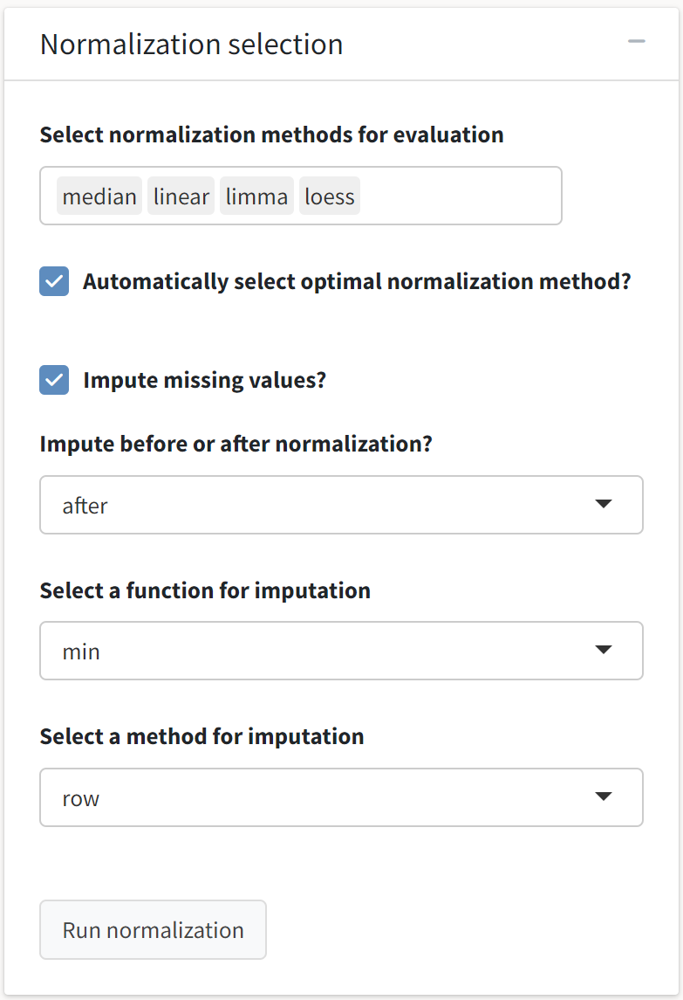
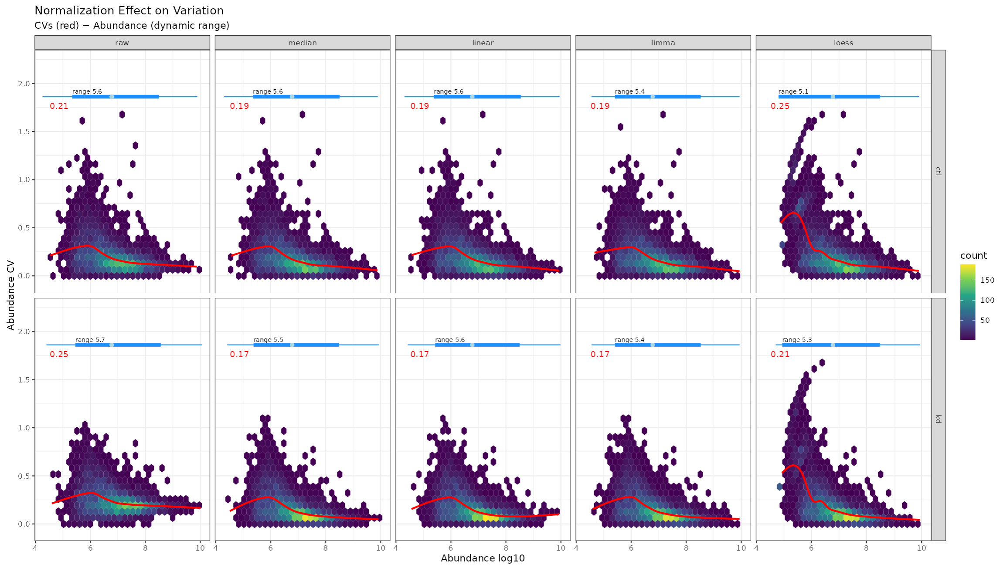

---
# Feel free to add content and custom Front Matter to this file.
# To modify the layout, see https://jekyllrb.com/docs/themes/#overriding-theme-defaults
# C:\projects\tidyproteomics-interactive\docs\assets\images\data_preprocessing
layout: default
title: Abundance normalization
nav_order: 2
parent: Data preprocessing
---
We are now prepared to subject our protein abundance matrix to the normalization routines offered by the *tidyproteomics* package. You can read more about the normalization and imputation procedures contained in the package on its <a href="https://jeffsocal.github.io/tidyproteomics/articles/normalizing.html" target="_blank">documentation website</a>.   

{: .warning}
Any modifications made to the data object in later tabs of the application (e.g., expression or enrichment analysis)  will be reset if normalization operations are re-executed. This is done to prevent misleading the user with outdated post-processing analysis outputs.

 
As the optimal normalization routine is often data dependent, it is generally advisable to evaluate several routines to see which provides the greatest benefits with regard to reduction in coefficient of variation and replicate clustering. Here, we will evaluate median, linear, quantile (i.e., limma), and LOESS normalization, and we will allow *tidyproteomics* to select the optimal normalization method based on reduction in CV and variance explained in top principal components.    

{: .note}
Deselecting the *Automatically select optimal normalization method* choice will allow you to use the raw abundance values for the principal component analysis scores plot and clustered abundance heatmap.

 
Additionally, we will accept the default parameters for imputing missing values in the data. Once we have selected our choices, the *Run normalization* button will be enabled.
  

  

{: .note}
Some normalization routines (e.g., `randomforest`) are computationally intensive and can take longer to execute. 

 Once we have selected our choices, the *Run normalization* button will be enabled. We will see several outputs after the operations have completed.
  

  
First, we see the abundance distributions plotted as a function of normalization procedure. The effect of each routine is evident from median shifting and outlier removal.
  

  
Next, we see the coefficient of variation (CV) estimates pooled across all proteins in a given replicate group. Most procedures here provide a marked reduction in CV, which is typically one of the objective functions normalization routines seek to minimize. We also see that the dynamic range of abundance values is largely unperturbed by most of these normalization routines.
  

  
We will also see non-linear regression of CV as a function of protein abundance. Reducing bias in CV over the dynamic range of abundance is also an objective of most normalization routines.
  

  
Next, we see a principal components analysis of the samples normalized with the optimal normalization routine as determined by the *tidyproteomics* package. Scores in the first principal coordinate are predictive of treatment group, which is a desirable outcome. We also see that normalization, regardless of routine, shifts more variance into the first principal component. 
  

  
The last analysis output we see is a hierarchically clustered heatmap of the replicates in each treatment group. Some of the differences that generalize within treatment groups may be evident in the subsequent differential expression analysis.
  

  
The application also generates an interactive table that contains all of the normalized protein abundances for the selected method along with sample metadata.
  

  
Finally, we see that our progress, as displayed in the application footer, has been updated.