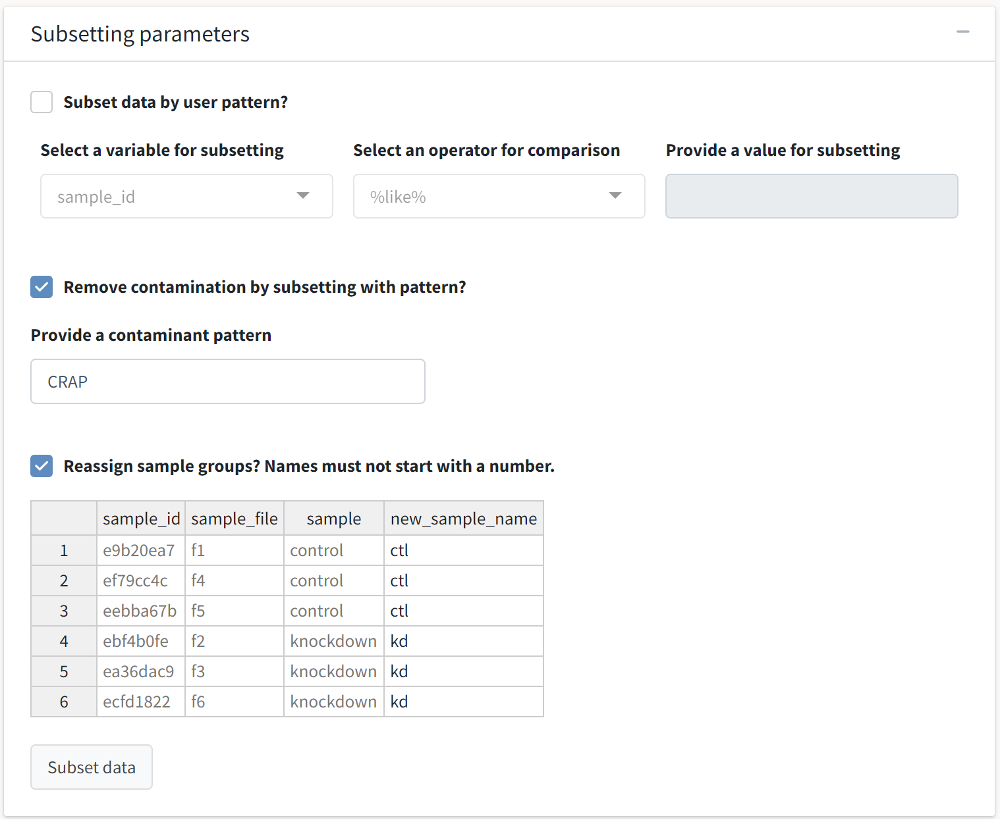

---
# Feel free to add content and custom Front Matter to this file.
# To modify the layout, see https://jekyllrb.com/docs/themes/#overriding-theme-defaults

layout: default
title: Data subsetting and summary
nav_order: 1
parent: Data preprocessing
---
We can continue with the analysis pipeline by pre-processing the example dataset included in the package. Select the *Data subsetting and summary* tab, where you will be greeted by the *Subsetting parameters* box. These inputs will allow you to subset the data by any qualitative or quantitative field in the *tidyproteomics* object, remove contaminant proteins by inputting a contaminant search pattern against proteins' descriptions, or (re)assign replicates to treatment groups. For example, specific replicates or proteins can be focused on or removed from the data object by using the `%like%` or `! %like%` patterns, respectively.   

{: .warning}
Any modifications made to the data object in later tabs of the application (e.g., normalization, expression, or enrichment analysis)  will be reset if subsetting operations are re-executed. This is done to prevent misleading the user with outdated post-processing analysis outputs.

 
Here, we will not subset the data but will opt to remove contaminant proteins and rename the treatment groups as a demonstration. The default contaminant pattern suggested by the application, `CRAP`, yielded contaminant proteins for this dataset on the *Data input and summary* tab. We should see these proteins removed from the data set after executing the subsetting operation. Additionally, the Excel-like table prompts the user to enter names for the treatment groups each replicate will be assigned to.  
  

  

{: .important}
The *Subset data* button will be deactivated if any of the three options in this box are checked without their fields having been completed.

 We are greeted by a familiar output: the tabbed summary box. This time, the tables reference the modified *tidyproteomics* object that has been subsetted by the user's search pattern or modified to have reassigned treatment groups.
  

  
The `experiments` feature of the object now reports the new treatment groups the files have been assigned to. Further, we can select the *Contaminant selection* tab and again search for the `CRAP` annotation.
  

  
This time, we see the `native` column reports 100% of the total abundance can be attributed to non-contaminant proteins. 

An important feature for tracking the user's progress in this application is the footer, which reports the important modifications to the original data invoked by pre-processing operations.
  

  
The display indicates we have removed contaminant proteins from the data object. This footer will be visible from all tabs in this application. Having completed all options in this tab, we can proceed to *Abundance normalization*. 