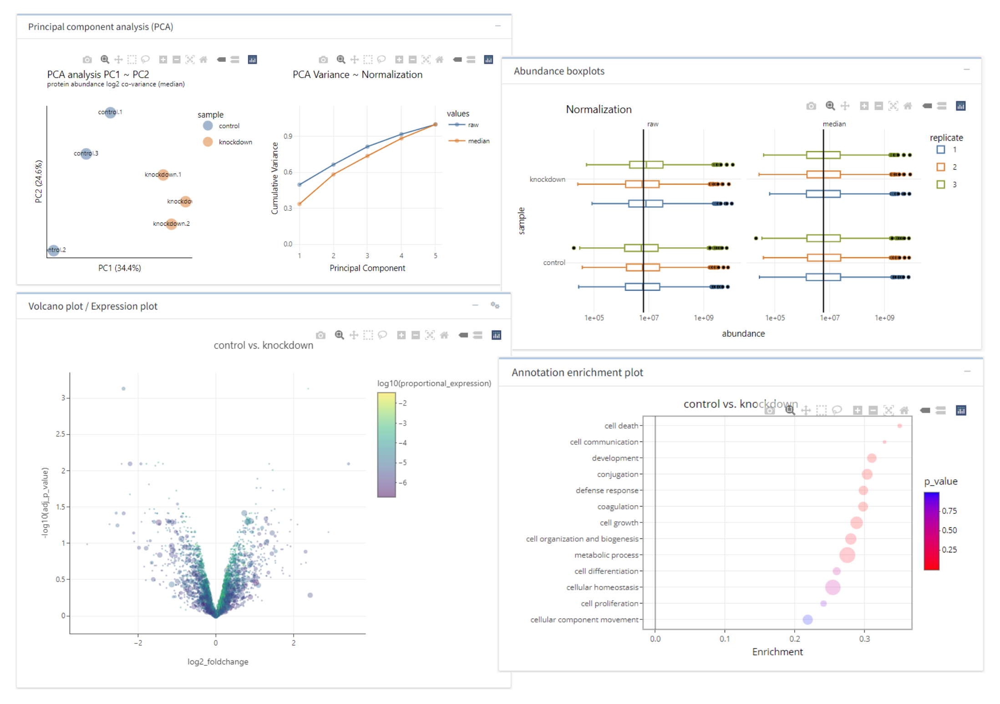

<h1 dir="auto" style="border-bottom: 1px solid grey; padding-bottom: 10px; box-sizing: border-box;">
    
    tidyproteomics-interactive
</h1>

This is the documentation page for [**tidyproteomics-interactive**](https://github.com/ejmackrell/tidyproteomics-interactive), a Shiny application for interactively working with the R package [**tidyproteomics**](https://github.com/jeffsocal/tidyproteomics). Users may upload their protein- or peptide-level data for abundance subsetting, contaminant removal, abundance normalization, differential expression analysis, and ontology enrichment.

